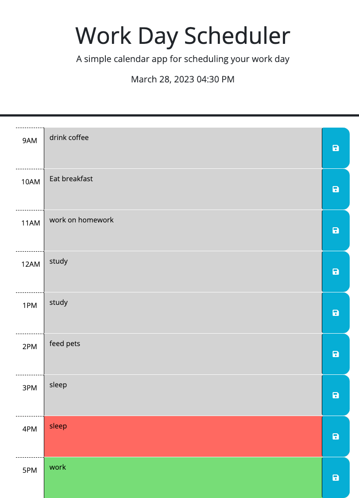

# WorkDaySchedule

## Description
    Fun prject to do if you wanna learn jQuery was a bit challenging due to the fact that I was low on time and only had a day to do but thats what notes are good for. Day js is super helpful when working with time makes things alot easier as well as bootstrap and jquery, they can really be helpful when writing out your code.

## Usage
    This site will be helpful to every day planning from 9-5 as in a 9-5 job, you just type whatever it is you have to do in that time in the box and then click the blue save button and it saves it all for you so you can leave the page and come back and itll still be there.

## Link

## License
    Please refer to the license in the repo